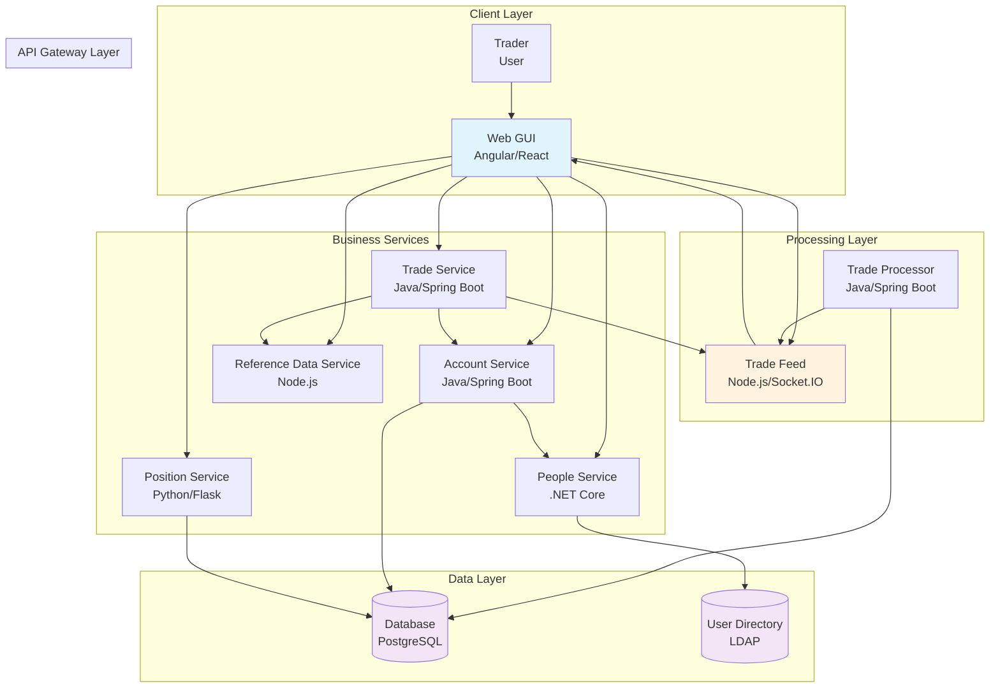
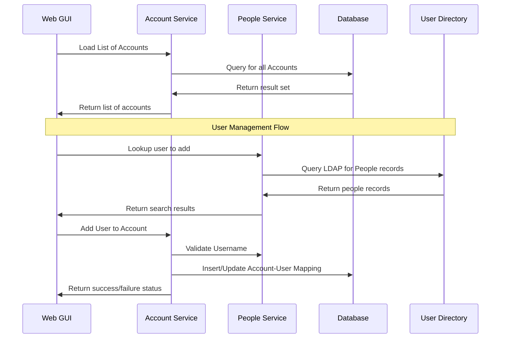
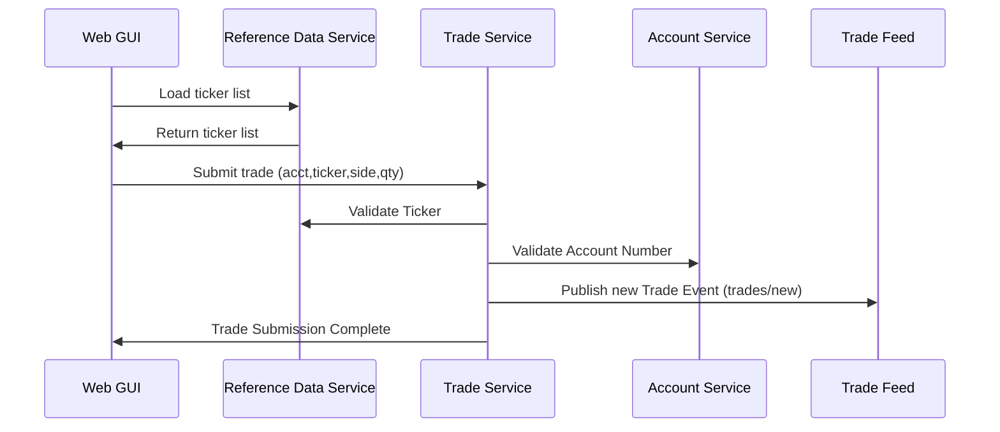
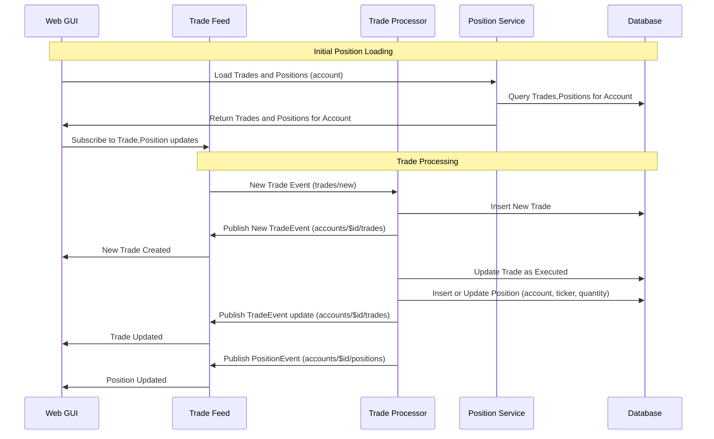

[](https://demo.traderx.finos.org/)
[](https://finosfoundation.atlassian.net/wiki/display/FINOS/Incubating)

# FINOS | TraderX Example of a Simple Trading App

 


## Table of Contents

- [Overview](#overview)
- [Architecture](#architecture)
  - [System Architecture](#system-architecture)
  - [Technology Stack](#technology-stack)
  - [Polyglot Architecture Benefits](#polyglot-architecture-benefits)
- [Key Application Flows](#key-application-flows)
  - [Account Management](#account-management)
  - [Trade Execution](#trade-execution)
  - [Position Updates](#position-updates)
- [Components](#components)
- [Quick Start](#quick-start)
- [Deployment Options](#deployment-options)
  - [Docker Compose (Recommended)](#docker-compose-recommended)
  - [Manual Setup](#manual-setup)
  - [Kubernetes](#kubernetes)
  - [GitHub Codespaces](#github-codespaces)
- [Development](#development)
  - [Corporate Environments](#corporate-environments)
- [Project Demo](#project-demo)
- [Getting Involved](#getting-involved)
- [Contributing](#contributing)
- [License](#license)

## Overview

TraderX is a Sample Trading Application, designed to be a distributed reference application 
in the financial services domain which can serve as a starting point for experimentation 
with various techniques and other open source projects. It is designed to be simple
and accessible to developers of all backgrounds, with minimal pre-assumptions, and it 
can serve as a starting point for educational and experimentation purposes.

It is designed to be runnable from any developer workstation with minimal assumptions
other than Node, Java and Python runtimes. The libraries and toolkits it uses are meant
to be as vanilla as possible, to preserve its approachability by developers of all levels.

It contains Java, NodeJS, Python, .NET components that communicate over REST APIs and
messaging systems and are able to showcase a wide range of technical challenges to solve.

**Key Features:**
- **Distributed Architecture**: Multiple services communicating via REST APIs and messaging
- **Polyglot Implementation**: Java, Node.js, Python, .NET components
- **Real-time Updates**: WebSocket-based trade and position streaming
- **Account Management**: User and account administration capabilities
- **Trade Execution**: Complete trade lifecycle from submission to settlement
- **Position Tracking**: Real-time position and trade blotter functionality

## Architecture

### System Architecture

The TraderX system follows a microservices architecture with clear separation of concerns. Each service handles specific business capabilities and communicates through well-defined APIs.



### Technology Stack

TraderX demonstrates a polyglot architecture using multiple programming languages and frameworks:

| **Service** | **Technology Stack** | **Purpose** |
|-------------|---------------------|-------------|
| **Web Frontend** | TypeScript, Angular/React, Bootstrap | Interactive trading interface |
| **Account Service** | Java, Spring Boot | Account management and validation |
| **Trade Service** | Java, Spring Boot | Trade order processing and validation |
| **Position Service** | Python, Flask | Position and trade history queries |
| **People Service** | .NET Core | User directory integration |
| **Reference Data** | Node.js, NestJS | Securities reference data |
| **Trade Processor** | Java, Spring Boot | Asynchronous trade settlement |
| **Trade Feed** | Node.js, Socket.IO | Real-time messaging and streaming |
| **Database** | PostgreSQL | Persistent data storage |

### Polyglot Architecture Benefits

The diverse technology stack in TraderX serves several educational and practical purposes:

- **Language Diversity**: Demonstrates how different languages excel in different domains (Java for enterprise services, Python for data processing, Node.js for real-time communication)
- **Framework Showcase**: Illustrates various frameworks and their strengths (Spring Boot for microservices, Flask for lightweight APIs, Socket.IO for real-time features)
- **Integration Patterns**: Shows how heterogeneous systems can work together through standard protocols (REST, WebSockets, SQL)
- **Learning Opportunities**: Provides developers exposure to multiple technology stacks in a single, cohesive application
- **Real-world Simulation**: Reflects typical enterprise environments where different teams may use different technologies


## Key Application Flows

TraderX implements several core business flows that demonstrate typical trading system operations:

### Account Management

Initial account loading and user management flow:



### Trade Execution

Complete trade submission and validation flow:



### Position Updates

Trade processing and position management flow:




## Project Components

The project consists of multiple moving parts, and you can see how things hang together by reviewing the architecture and sequence diagrams located in the [docs](docs) directory.


| *Component* | *Tech Stack* |*Description* |
| :--- | :--- | :--- |
| [docs](docs) | markdown | Architecture and Flow Diagrams are here! |
| [database](database) | postgresql | A production-ready PostgreSQL database |
| [reference-data](reference-data) | node/nestjs | REST service (off a flat file) for querying ticker symbols |
| [trade-feed](trade-feed) | node/socketio | Message bus used for trade flows, as well as streaming to the GUI |
| [people-service](people-service) | .Net core | Service for looking up users, for account mangement |
| [account-service](account-service) | java/spring | Service for querying and validating accounts |
| [position-service](position-service) | java/spring | Position service for looking up positions and trades by the blotter |
| [trade-service](trade-service) | java/spring | Service for submitting trade/order requests for further processing |
| [trade-processor](trade-processor) | java/spring | Trade Feed consumer which processes trade/orders |
| [web-front-end](web-front-end) | html/angular or react | Interactive UI for executing trades and viewing blotter. Note: the AngularJS GUI was an initial contribution and contains account management capabilities. The React GUI was contributed during a hack day and may not work for managing accounts, but it does work for executing trades and viewing the blotter |

## Check out Code

This is installed locally through normal git clone operations.

```
git clone https://github.com/finos/traderX.git
```

## Run locally

There are a number of ways to run TraderX locally. You should choose the method you are most comfortable with.
- [Run locally manually](#run-locally-manually)
- [Run locally within a Corporate Environments](#run-locally-within-a-corporate-environments)
- [Run locally using Docker & Docker Compose](#run-locally-using-docker--docker-compose)
- [Run locally using Kubernetes](#run-locally-using-kubernetes)

#### Port Configuration

Export these environment variables for manual setup:

```bash
export DATABASE_TCP_PORT=18082
export DATABASE_PG_PORT=18083
export DATABASE_WEB_PORT=18084
export REFERENCE_DATA_SERVICE_PORT=18085
export TRADE_FEED_PORT=18086
export ACCOUNT_SERVICE_PORT=18088
export PEOPLE_SERVICE_PORT=18089
export POSITION_SERVICE_PORT=18090
export TRADE_PROCESSOR_SERVICE_PORT=18091
export TRADING_SERVICE_PORT=18092
export WEB_SERVICE_ANGULAR_PORT=18093  # Angular
export WEB_SERVICE_REACT_PORT=18094    # React
```

#### Service Startup Sequence

Start services in this order to ensure proper dependencies:

```bash
1. database
2. reference-data
3. trade-feed
4. people-service
5. account-service
6. position-service
7. trade-processor
8. trade-service
9. web-front-end
```

### Kubernetes

Deploy to your local Kubernetes cluster using Tilt for development:

#### Prerequisites 
- [Docker](https://www.docker.com/products/docker-desktop/) 
- Kubernetes cluster ([Docker Desktop](https://docs.docker.com/desktop/kubernetes/), [Kind](https://kind.sigs.k8s.io/), [Minikube](https://minikube.sigs.k8s.io/docs/start/), or [k3s](https://k3s.io/))
- [Ingress Controller](https://kubernetes.github.io/ingress-nginx/deploy/)
- [Tilt](https://tilt.dev)

#### Deployment

```bash
# Verify Kubernetes is running
kubectl get pods

# Navigate to GitOps directory
cd ./gitops/local/

# Start Tilt (opens browser at http://localhost:10350)
tilt up

# Clean up when done
tilt down
```

For local development, uncomment specific services in the [Tiltfile](./gitops/local/Tiltfile) to build and deploy local images instead of pre-built ones.

### GitHub Codespaces

TraderX runs seamlessly in GitHub Codespaces:

1. Click the **Code** button → **Codespaces** tab → **"..."** → **"New with options..."**
2. Select **8-core machine** with **32GB RAM**
3. Click **"Create codespace"**
4. Once started, run: `docker compose up`
5. Access at http://localhost:8080 (automatically forwarded)

**Note**: Personal GitHub accounts receive 120 free core hours per month. See [GitHub Codespaces billing](https://docs.github.com/en/billing/managing-billing-for-github-codespaces/about-billing-for-github-codespaces#monthly-included-storage-and-core-hours-for-personal-accounts) for details.

## Development

### Corporate Environments

When building in corporate environments with artifact repositories, you may need to override Maven/Gradle settings:

#### Gradle Configuration

Create a `.corp` directory for company-specific build scripts:

```bash
# In the traderX main directory
mkdir .corp
cd .corp
touch settings.gradle
```

Add repository overrides to `settings.gradle`:

```groovy
rootProject.name = 'finos-traderX'
includeFlat 'database'
includeFlat 'account-service'
includeFlat 'position-service'
includeFlat 'trade-service'
includeFlat 'trade-processor'
```

Build using corporate settings:

```bash
# From traderX root
gradle --settings-file .corp/settings.gradle build
gradle --settings-file .corp/settings.gradle account-service:bootRun

# From .corp directory
cd .corp
./gradlew build
./gradlew account-service:bootRun
```

## Project Demo

Learn more about TraderX in this keynote demo from the [Open Source in Finance Forum 2023](https://events.linuxfoundation.org/open-source-finance-forum-new-york/):

[](https://youtu.be/tSKDJlRYkm0?list=PLmPXh6nBuhJueQS5q-5IU3-0vmZEIUbz0&t=400)

## Getting Involved

### Project Meetings

Join the bi-weekly Friday TraderX community meetings:
- Email help@finos.org to be added to the meeting invite
- Find meetings in the [FINOS Community Calendar](https://calendar.finos.org/)

## Contributing

1. Fork it (<https://github.com/finos/traderx/fork>)
2. Create your feature branch (`git checkout -b feature/fooBar`)
3. Read our [contribution guidelines](https://github.com/finos/traderx/blob/main/CONTRIBUTING.md) and [Community Code of Conduct](https://www.finos.org/code-of-conduct)
4. Commit your changes (`git commit -am 'Add some fooBar'`)
5. Push to the branch (`git push origin feature/fooBar`)
6. Create a new Pull Request

*NOTE:* Commits and pull requests to FINOS repositories will only be accepted from those contributors with an active, executed Individual Contributor License Agreement (ICLA) with FINOS OR who are covered under an existing and active Corporate Contribution License Agreement (CCLA) executed with FINOS. Commits from individuals not covered under an ICLA or CCLA will be flagged and blocked by the FINOS Clabot tool. Please note that some CCLAs require individuals/employees to be explicitly named on the CCLA.

*Need an ICLA? Unsure if you are covered under an existing CCLA? Email [help@finos.org](mailto:help@finos.org)*

## License

Copyright 2023 UBS, FINOS, Morgan Stanley

Distributed under the [Apache License, Version 2.0](http://www.apache.org/licenses/LICENSE-2.0).

SPDX-License-Identifier: [Apache-2.0](https://spdx.org/licenses/Apache-2.0)
